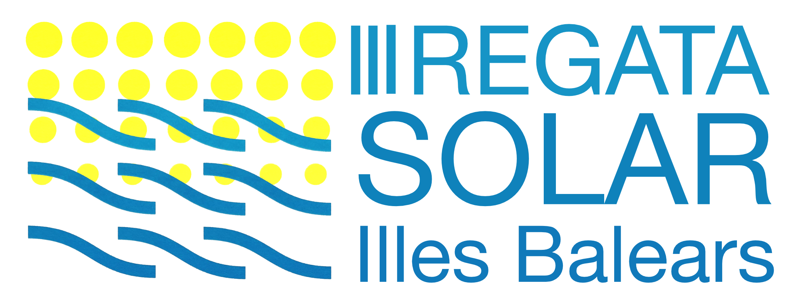
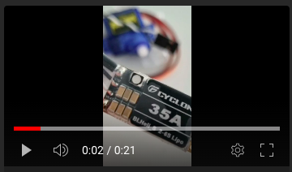
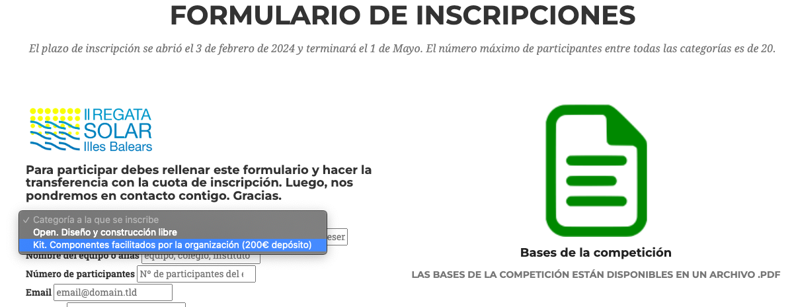

# Kit de barco solar para participar en la Regata Solar Illes Balears
 
## Lista de componentes del kit para construir tu barco
### Electrónica
| Panel | Mando a distancia| Motor | Regulador y Servo |
|-----------|-----------|-----------|-----------|
|  |  |  |         |

### Mecánica
| Soporte |
|-----------|
|  |

## ¿Cómo conseguirlo?
Puedes obtener tu kit de barco solar inscribiéndote en [la web de la Regata](https://www.regatasolarbalears.org/) en el formulario final:

 

## ¿Cómo montarlo?
Cada 15 días se celebrará en el FabLab de Mallorca un taller gratuito para ayudarte a montar tu ki y tu barco. Puedes inscrbirte e informarte de las fechas en la redes sociales y en Meetup: https://www.meetup.com/es-ES/makespace-mallorca/
