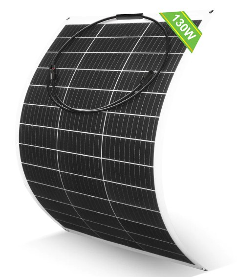
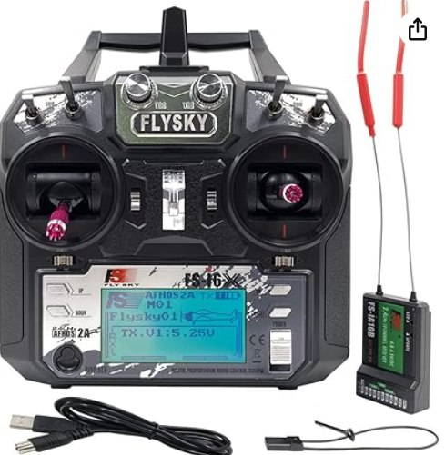
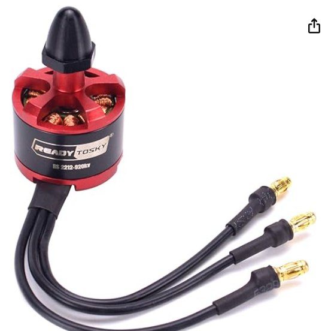
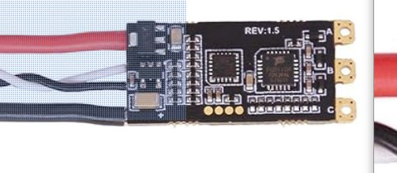
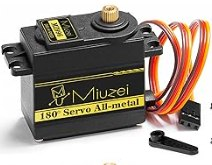
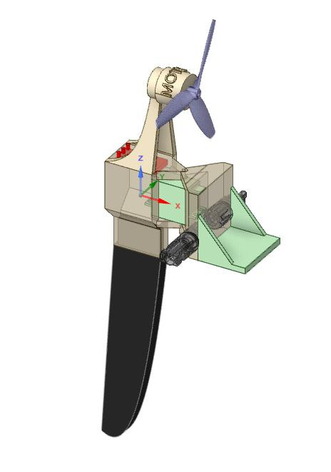

# Lista de componentes del kit para construir tu barco

## Electrónica
| Panel | Mando a distancia| Regulador| 
|-----------|-----------|-----------|
|  |  |  |

| Regulador | Servo|
|-----------|-----------|
|  |  |

## Mecánica
| Soporte |
|-----------|
|  |
